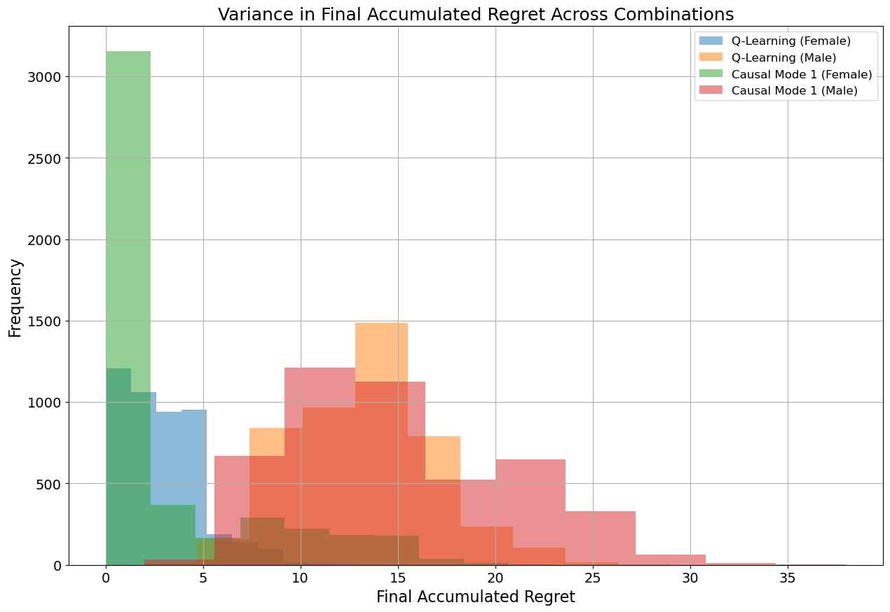

# Causal-Decision-Making : Causal Reinforcement Learning

## Overview
This repository contains the implementation and analysis for the CS 295 Final Project, conducted by Jay Yoo during Winter 2025 at UCI. The project investigates the integration of causal inference with reinforcement learning (RL) to improve decision-making in medical treatment scenarios. It builds on frameworks by Muller and Pearl for personalized and population-based decision-making, emphasizing the role of observational data and monotonicity conditions in estimating individual treatment effects (ITE).

The project compares a standard Q-learning agent with a causally-informed RL agent, evaluating performance in terms of cumulative regret and reward across different causal response type distributions for male and female patients.

## Key Concepts

### Causal Inference
Causal inference is used to estimate the **probability of benefit** (\(P(\text{benefit})\)) and **probability of harm** (\(P(\text{harm})\)) using observational and experimental data. **Counterfactual logic** models outcomes under hypothetical interventions, denoted as \(Y_x(u) = y\) (“\(Y\) would be \(y\) had \(X\) been \(x\) for unit \(u\)”). The **Individual Treatment Effect (ITE)** is defined as:

\[
\text{ITE} = Y(1, u) - Y(0, u)
\]

The **Conditional Average Treatment Effect (CATE)** extends this to subgroups:

\[
\text{CATE}(u) = \mathbb{E}[Y(do(A=1), u') - Y(do(A=0), u') \mid C(u') = C(u)]
\]

The probability of benefit, \(P(\text{benefit})\), quantifies the likelihood that an individual will experience a positive outcome as a result of the treatment. Conversely, the probability of harm, \(P(\text{harm})\), represents the likelihood of a negative outcome due to the treatment. Formally,

\[
P(\text{benefit}) = Y(y_t,y'_c), \text{ and } P(\text{harm}) = Y(y'_t,y_c) = 1 - P(\text{benefit})
\].

These probabilities can be bounded using observational and experimental data as follows:

\[
\max\left\{\begin{aligned}
            &0, \\
           &P(y_t) - P(y_c), \\
           &P(y) - P(y_c), \\
           &P(y_t) - P(y)
           \end{aligned}\right\} 
\leq P(\text{benefit}) \leq
\min\left\{\begin{aligned}
            &P(y_t), \\
           &P(y'_c), \\
           &P(t, y) + P(c, y)', \\
           &P(y_t) - P(y_c) + P(t, y') + P(c, y)
           \end{aligned}\right\}
\]

### Monotonicity
**Monotonicity** assumes no harm from treatment (\(P(\text{harm}) = 0\)), simplifying analysis as \(\text{ATE} = P(\text{benefit})\). The project tests scenarios where monotonicity holds (female patients) and where it does not (male patients).

### Reinforcement Learning
Two agents are compared:
- **Q-learning Agent (\(\mathcal{A}_Q\))**: Standard RL without causal knowledge, updated via:

\[
Q(s_t, a_t) \leftarrow Q(s_t, a_t) + \alpha \left[ r_t + \gamma \max_{a} Q(s_{t+1}, a) - Q(s_t, a_t) \right]
\]

- **Causal Agent (\(\mathcal{A}_C\))**: Incorporates causal knowledge via a causal graph (\(\mathcal{G}\)) and updates bounds on \(P(\text{benefit})\) and \(P(\text{harm})\). It operates in four modes:
  1. **Strict P(harm)**: True if upper bound of \(P(\text{harm})\) is zero.
  2. **Optimistic P(harm)**: True if lower bound of \(P(\text{harm})\) is zero.
  3. **Benefit-Harm Comparison**: True if upper bound of \(P(\text{benefit})\) exceeds upper bound of \(P(\text{harm})\).
  4. **Mean Benefit Comparison**: Compares mean bounds of \(P(\text{benefit})\) and \(P(\text{harm})\).

### Causal Response Types
Patients are categorized based on treatment response:
- **Always-takers**: Outcome occurs regardless of treatment (\(Y(do(A=1)) = Y(do(A=0)) = 1\)).
- **Compliers**: Positive response to treatment (\(Y(do(A=1)) = 1\), \(Y(do(A=0)) = 0\)).
- **Defiers**: Negative response to treatment (\(Y(do(A=1)) = 0\), \(Y(do(A=0)) = 1\)).
- **Never-takers**: No outcome regardless of treatment (\(Y(do(A=1)) = Y(do(A=0)) = 0\)).

Distributions vary by gender:

| Gender | Always-takers | Compliers | Defiers | Never-takers |
|--------|---------------|-----------|---------|--------------|
| Female | 0.21          | 0.28      | 0.00    | 0.51         |
| Male   | 0.00          | 0.49      | 0.21    | 0.30         |

### Numerical Example

*Figure: Observational, and Experimental data tables from the original paper.*

Consider a study with both observational and experimental data available for males and females. The observational study revealed that only 70% of men and 70% of women actually chose to take the drug.
The bounds on the probability of benefit are calculated, using the equation above and data from the figure, as:

For females:

\[
0.279 \leq P(\text{benefit}|\text{female}) \leq 0.279
\]

For males:

\[
0.49 \leq P(\text{benefit}|\text{male}) \leq 0.49
\]

With absence of experimental data, the bounds widen to:

\[
0.0 \leq P(\text{benefit}|\text{female}) \leq 0.279, \quad 0.0 \leq P(\text{benefit}|\text{male}) \leq 0.58
\]

Similarly, without the observational data, the bounds widen to:

\[
0.279 \leq P(\text{benefit}|\text{female}) \leq 0.489, \quad 0.28 \leq P(\text{benefit}|\text{male}) \leq 0.49
\]

Proving the usefulness of observational in analysis.

Under monotonicity, the CATE serves as a point estimate for \(P(\text{benefit})\). For instance:

\[
\text{CATE}(\text{female}) = 0.279, \quad \text{CATE}(\text{male}) = 0.28
\]

The probabilities of harm are then:

\[
P(\text{harm}|\text{female}) = P(\text{benefit}|\text{female}) - \text{CATE}(\text{female}) = 0
\]

\[
P(\text{harm}|\text{male}) = P(\text{benefit}|\text{male}) - \text{CATE}(\text{male}) = 0.21
\]

## Experimental Setup

### Environment Model
The environment is formalized as a Markov Decision Process (MDP) $M$ characterized by the tuple $\langle S, A, R \rangle$ where:
$S$ is the state space, $A$ is the action space, and $R: S \times A \times S \rightarrow \mathbb{R}$ is the reward function.

*Figure: Model representations: (a) Markov Decision Process (MDP) showing states, actions, and rewards with partial randomness due to unobserved Causal Response Types. (b) Structural Causal Model (SCM) illustrating the influence of unobserved confounder U on decision x and outcome Y.*

In Figure [fig:mdp], we illustrate the Markov Decision Process (MDP) for our scenario. Here, $S_t$ represents the initial state, while $S_c$ denotes the state after taking a corresponding action a from the set of possible actions A. The squares in the diagram represent the resulting rewards. It is important to note that due to the unobserved Causal Response Types of individuals, the MDP introduces partial randomness, which we have represented using dotted line arrows.

We can also represent this environmental model using a Structural Causal Model (SCM), as shown in Figure [fig:scm]. In this representation, the distribution of unobserved Causal Response Types, U, acts as an unobserved confounder. This confounder influences both the causal model's decision x (which belongs to the set X) and the outcome Y. The SCM representation provides an intuitive and definitive explanation for calculating P(benefit) and P(harm) using observational and experimental data. However, in our original submission, I did not explicitly introduce this representation. This is because the bounds of these probabilities are formally defined and can be directly calculated from the data using the provided equations.

### Datasets
- **Random Sample**: 500 patients per gender, generated via `np.random.choice` to approximate response type distributions.
- **Permutations**: 4,618 permutations of 50 patients, strictly adhering to distributions (e.g., 10 Always-takers, 14 Compliers, 26 Never-takers for females). Note: A bug may limit permutation count (theoretical: ~\(2.3838 \times 10^{20}\)).

### Metrics
- **Cumulative Regret**: Binary (1 if a better action exists, 0 otherwise).
- **Cumulative Reward**: 1 for survival, -1 otherwise.
- Evaluated over 500 episodes.

## Results
- **Random Sample**:
  - The **Optimistic P(harm)** mode excelled for female patients (monotonicity holds), with lower regret and higher reward than Q-learning.
  - For male patients (non-monotonic), Optimistic mode showed mixed results, outperforming in some cases.
  - **Strict P(harm)** underperformed, while **Benefit-Harm** and **Mean Benefit** modes were similar to Q-learning.

*Figure: Accumulated regret and reward for Q-learning and causal agent modes.*

- **Permutations**:
  - Optimistic mode showed the lowest regret and highest reward across 4,618 permutations.
  - Distribution analysis revealed significant performance differences, suggesting causal knowledge improves sample efficiency.

*Figure: Results over all possible combinations of 50 patients.*

*Figure: Regret and reward distribution for Optimistic mode vs. Q-learning.*

## Limitations
- Permutation dataset may have a bug, generating only 4,618 permutations.
- Permutations assume equal likelihood, ignoring real-world probabilities.
- Causal agent performance needs further formal analysis to quantify improvements.

## Acknowledgments
I express great gratitude to Professor Rina Detcher for her valuable guidance on causality in reinforcement learning.

## References
- Muller, S., & Pearl, J. (2023). Personalized Decision Making with Observational Data. *arXiv preprint arXiv:2303.12692*.
- Muller, S., & Pearl, J. (2023). Monotonicity in Causal Inference. *arXiv preprint arXiv:2303.12693*.
- Li, Y., et al. (2019). Unit Selection in Causal Inference. *Journal of Causal Inference*.
- Tian, J., & Pearl, J. (2000). Probabilities of Causation: Bounds and Identification. *Annals of Mathematics and Artificial Intelligence*.
- Bubeck, S., & Cesa-Bianchi, N. (2012). Regret Analysis of Stochastic and Nonstochastic Multi-armed Bandit Problems. *Foundations and Trends in Machine Learning*.

